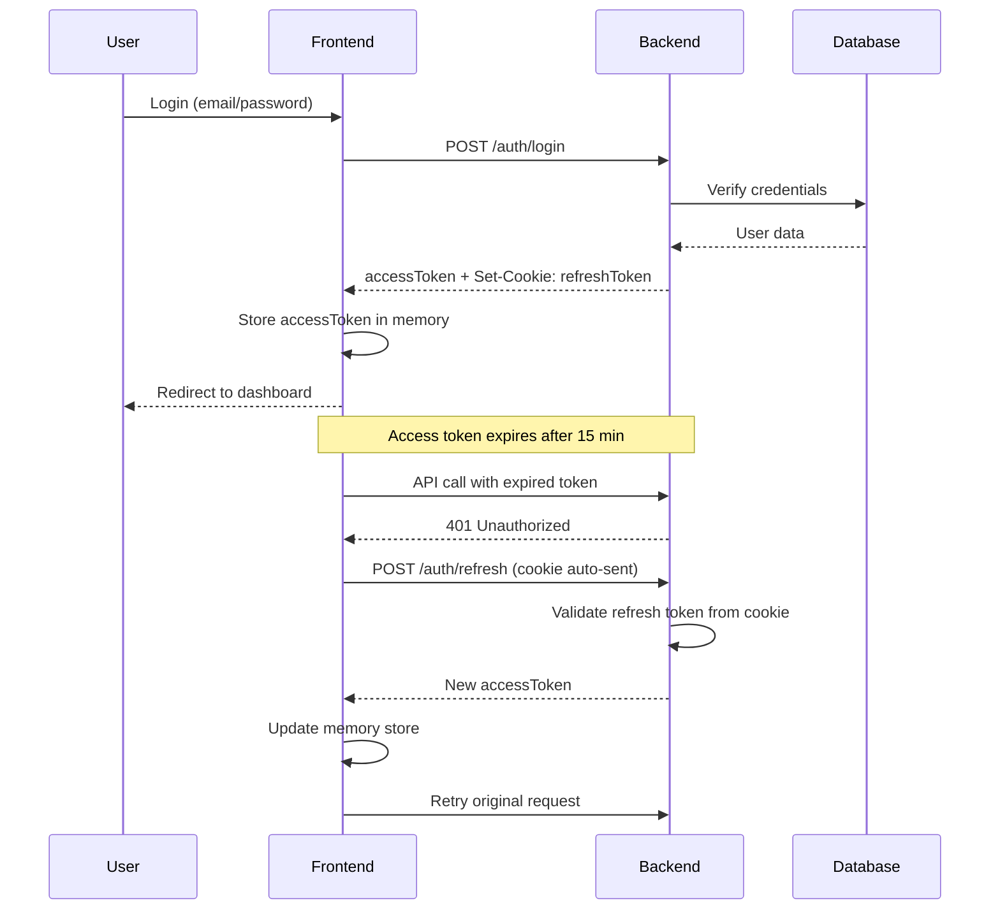
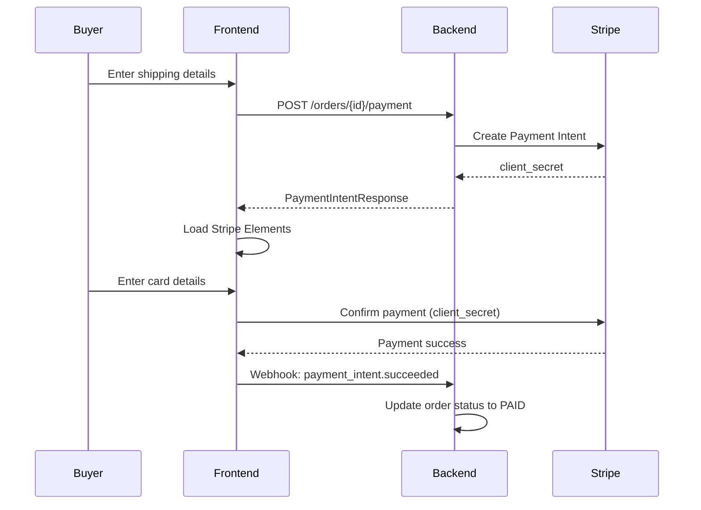

# BidStorm - Vietnamese Online Auction Platform 🔨

<div align="center">


**A modern, real-time auction platform built with Next.js 15 and Spring Boot**

[](https://nextjs.org/)
[](https://react.dev/)
[](https://www.typescriptlang.org/)
[](https://tailwindcss.com/)

</div>

---

## 📑 Table of Contents

- [Overview](#-overview)
- [Key Features](#-key-features)
- [Tech Stack](#-tech-stack)
- [Architecture & Design Patterns](#-architecture--design-patterns)
- [Authentication & Security](#-authentication--security)
- [Real-time Features](#-real-time-features)
- [Payment Integration](#-payment-integration)
- [Cloud Storage](#-cloud-storage)
- [Project Structure](#-project-structure)
- [Getting Started](#-getting-started)
- [API Integration](#-api-integration)
- [Environment Variables](#-environment-variables)
- [Development Workflow](#-development-workflow)
- [Key Components](#-key-components)
- [State Management](#-state-management)
- [Form Validation](#-form-validation)
- [License](#-license)

---

## 🎯 Overview

**BidStorm** is a comprehensive Vietnamese online auction platform that enables users to buy and sell products through competitive bidding. The platform features a minimalist black-and-white design philosophy and supports multiple user roles: **Guests**, **Bidders** (buyers), **Sellers**, and **Administrators**.

### User Roles

- **👤 Guest**: Browse products, search, view categories
- **🎯 Bidder**: Place bids, manage watchlist, participate in auctions
- **🏪 Seller**: List products, manage auctions, respond to bidders
- **👑 Admin**: Manage categories, users, products, system configuration

---

## ✨ Key Features

### For Guests

- 🔍 **Full-text search** with Vietnamese support (no diacritics)
- 📂 **Two-level category system** with dynamic navigation
- 📊 **Homepage highlights**: Top 5 ending soon, most bids, highest price
- 📱 **Responsive design**: Mobile-first approach
- 🔐 **Registration** with reCAPTCHA and OTP verification

### For Bidders

- 💰 **Automatic bidding algorithm** with max bid functionality
- ❤️ **Watch List** to save favorite products
- 💬 **Live Q&A** with sellers
- 📜 **Bid history tracking** with masked privacy
- ⭐ **Rating system** (80%+ required for bidding)
- 📧 **Email notifications** for bid updates

### For Sellers

- 📝 **Product listing** with WYSIWYG editor (TinyMCE)
- 📸 **Image uploads** (minimum 3 images per product)
- 🚫 **Reject bidders** functionality
- ⏰ **Auto-extend auctions** (configurable)
- 💬 **Answer bidder questions**
- 📦 **Order fulfillment workflow**

### For Admins

- 📊 **Dashboard** with statistics and charts (Recharts)
- 👥 **User management** with role upgrades
- 📁 **Category CRUD operations**
- 🛡️ **Product moderation**
- ⚙️ **System configuration** (auto-extend timing, etc.)

### Post-Auction Features

- 💳 **Stripe payment integration**
- 📦 **Shipment tracking**
- 💬 **Order-specific chat** (WebSocket)
- ⭐ **Mutual rating system**
- 🔄 **Transaction cancellation** with automatic penalties

---

## 🛠 Tech Stack

### Frontend Core

| Technology          | Version | Purpose                            |
| ------------------- | ------- | ---------------------------------- |
| **Next.js**         | 16.0.7  | React framework with App Router    |
| **React**           | 19.2.0  | UI library with Server Components  |
| **TypeScript**      | 5.x     | Type-safe development              |
| **Tailwind CSS**    | 4.x     | Utility-first styling              |
| **Montserrat Font** | Latest  | Primary typography via `next/font` |

### State Management & Data Fetching

| Library             | Purpose                               |
| ------------------- | ------------------------------------- |
| **Zustand**         | Lightweight global state (auth store) |
| **React Hook Form** | Form state management                 |
| **Zod**             | Schema validation                     |

### Real-time Communication

| Technology        | Purpose                    |
| ----------------- | -------------------------- |
| **STOMP.js**      | WebSocket protocol         |
| **SockJS Client** | WebSocket fallback support |

### UI & UX Libraries

| Library            | Purpose                                |
| ------------------ | -------------------------------------- |
| **react-icons**    | Icon components (Feather icons)        |
| **react-toastify** | Toast notifications                    |
| **TinyMCE**        | WYSIWYG rich text editor               |
| **Recharts**       | Data visualization for admin dashboard |
| **GSAP**           | Advanced animations                    |
| **he**             | HTML entity decoding                   |

### Authentication & Security

| Service               | Purpose                    |
| --------------------- | -------------------------- |
| **JWT**               | Access token (in-memory)   |
| **HTTP-only cookies** | Refresh token storage      |
| **Google OAuth 2.0**  | Social authentication      |
| **reCAPTCHA v2**      | Bot prevention             |
| **bcrypt/scrypt**     | Password hashing (backend) |

### Payment Processing

| Service    | Purpose                     |
| ---------- | --------------------------- |
| **Stripe** | Payment gateway integration |

### Cloud Services

| Service       | Purpose                 |
| ------------- | ----------------------- |
| **Amazon S3** | Image and file storage  |
| **AWS SDK**   | S3 operations (backend) |

### Developer Tools

| Tool         | Purpose                              |
| ------------ | ------------------------------------ |
| **ESLint**   | Code linting                         |
| **Prettier** | Code formatting with Tailwind plugin |

---

## 🏗 Architecture & Design Patterns

### 1. **Client-Server Architecture (CSR)**

- **Frontend**: Single Page Application (SPA) with Next.js App Router
- **Backend**: RESTful API (Spring Boot) + WebSocket endpoints
- **Clear separation**: Frontend handles presentation, backend handles business logic

### 2. **Flux Architecture Pattern**

```
┌─────────────┐
│   Actions   │ ──▶ User interactions, API calls
└─────────────┘
       │
       ▼
┌─────────────┐
│  Dispatcher │ ──▶ Zustand store, Next.js cache
└─────────────┘
       │
       ▼
┌─────────────┐
│   Stores    │ ──▶ authStore, server cache
└─────────────┘
       │
       ▼
┌─────────────┐
│    Views    │ ──▶ React components
└─────────────┘
```

### 3. **Server Components First**

- **Default**: All components are Server Components
- **Client boundary**: Marked with `"use client"` only when needed
  - Event handlers (onClick, onChange)
  - Browser APIs (localStorage, window)
  - React hooks (useState, useEffect)
  - Zustand stores

### 4. **Layered Architecture**

```
┌─────────────────────────────────────────────┐
│           Presentation Layer                │
│  (Components, Pages, UI)                    │
└─────────────────────────────────────────────┘
                    ▼
┌─────────────────────────────────────────────┐
│          Business Logic Layer               │
│  (Hooks, Validators, Utils)                 │
└─────────────────────────────────────────────┘
                    ▼
┌─────────────────────────────────────────────┐
│           Data Access Layer                 │
│  (API Services, WebSocket Hooks)            │
└─────────────────────────────────────────────┘
                    ▼
┌─────────────────────────────────────────────┐
│          API Communication Layer            │
│  (Custom Fetch Wrapper)                     │
└─────────────────────────────────────────────┘
```

### 5. **Service Layer Pattern**

All API calls are abstracted into service modules:

```typescript
// services/products.ts
export const getProductDetails = async (slug: string) => {
  const response = await api.get<ProductResponse>(`/products/${slug}`);
  return response.data;
};
```

### 6. **Custom API Wrapper Pattern**

```typescript
// api/fetch.ts - Centralized error handling & auth
export const api = {
  get: <T>(url: string, options?: FetchOptions) => {...},
  post: <T>(url: string, body?: any, options?: FetchOptions) => {...},
  // Automatically:
  // - Adds JWT token when auth: true
  // - Unwraps ApiResponse<T>
  // - Redirects on 401
  // - Extracts error messages
};
```

### 7. **Guard Pattern for Route Protection**

```typescript
<AuthGuard>        // Requires authentication
  <RoleGuard role="SELLER">  // Requires specific role
    {children}
  </RoleGuard>
</AuthGuard>
```

### 8. **Repository Pattern**

Each domain has its own service file acting as a repository:

- `services/auth.ts` - Authentication operations
- `services/products.ts` - Product CRUD
- `services/bids.ts` - Bidding operations
- `services/orders.ts` - Order management
- `services/profile.ts` - User profile

### 9. **Observer Pattern (WebSocket)**

Real-time features use pub/sub via STOMP:

```typescript
// Subscribe to product bids
client.subscribe(`/topic/product/${id}/bids`, (message) => {
  const event = JSON.parse(message.body);
  // Update UI reactively
});
```

### 10. **Barrel Export Pattern**

```typescript
// components/ui/index.ts
export * from "./category";
export * from "./product";
export * from "./common";

// Usage
import { ProductCard, CategoryTree, Pagination } from "@/components/ui";
```

---

## 🔐 Authentication & Security

### JWT Token Strategy

#### Two-Token System

1. **Access Token** (Short-lived: 15 minutes)
   - Stored in **memory only** (Zustand store)
   - Sent in `Authorization: Bearer <token>` header
   - Never persisted to localStorage/sessionStorage
   - Cleared on page refresh (security feature)

2. **Refresh Token** (Long-lived: 7 days)
   - Stored in **HTTP-only cookie** (inaccessible to JavaScript)
   - Automatically sent by browser with `credentials: 'include'`
   - Secure, SameSite=Strict flags
   - Used to obtain new access tokens

#### Authentication Flow



#### Session Restoration

```typescript
// On app load (AuthProvider)
useEffect(() => {
  restoreSession(); // Calls /auth/refresh with httpOnly cookie
}, []);
```

#### Google OAuth 2.0 Integration

```typescript
// Google Sign-In button component
<GoogleLogin
  onSuccess={(credentialResponse) => {
    const { credential } = credentialResponse;
    // Send to backend: POST /auth/google/callback
    googleLogin(credential);
  }}
/>
```

**Backend verifies Google token** and issues our own JWT tokens.

### Security Measures

| Feature               | Implementation                        |
| --------------------- | ------------------------------------- |
| **Password Hashing**  | bcrypt/scrypt with salt rounds        |
| **CSRF Protection**   | SameSite cookies                      |
| **XSS Prevention**    | Content Security Policy, sanitization |
| **SQL Injection**     | Parameterized queries (JPA)           |
| **Rate Limiting**     | Backend throttling                    |
| **reCAPTCHA**         | Bot prevention on registration        |
| **OTP Verification**  | Email confirmation required           |
| **Role-based Access** | Guard components + middleware         |

---

## ⚡ Real-time Features

### WebSocket Architecture (STOMP over SockJS)

#### Dual-Channel Broadcasting

For privacy, each feature has **two channels**:

**1. Comments System**

```typescript
// Public channel (masked names)
/topic/cdoprtu /
  { id } /
  comments /
  // Seller channel (unmasked names)
  topic /
  product /
  { id } /
  comments /
  seller;
```

**2. Bidding System**

```typescript
// Public channel (masked names, own max bid only)
/topic/cdoprtu /
  { id } /
  bids /
  // Seller channel (all names + max bids visible)
  topic /
  product /
  { id } /
  bids /
  seller;
```

**3. Order Chat**

```typescript
// Buyer-Seller private chat
/topic/deorr / { orderId } / chat;
```

#### Event Types

**Bid Events**

```typescript
interface BidEvent {
  type: "NEW_BID" | "BID_REJECTED";
  productId: number;
  bid?: BidResponse; // With isHighestBidder flag
  currentPrice?: number; // Updated auction price
  highestBidder?: string; // Updated highest bidder (masked if needed)
}
```

**Comment Events**

```typescript
interface CommentEvent {
  type: "NEW_COMMENT" | "DELETE_COMMENT";
  productId: number;
  comment?: CommentResponse; // For NEW_COMMENT
  commentId?: number; // For DELETE_COMMENT
}
```

**Order Chat Events**

```typescript
interface OrderChatEvent {
  type: "NEW_MESSAGE";
  orderId: number;
  message: ChatMessageResponse;
}
```

#### Automatic Bidding Algorithm

The **backend** implements automatic bidding logic:

1. User submits max bid amount
2. System automatically increments current price by step amount
3. If another user bids, system auto-counters up to max bid
4. Tie-breaking: Earlier timestamp wins
5. Backend sets `isHighestBidder: true` flag

**Frontend never calculates who wins** - always trusts backend's `isHighestBidder` flag.

#### Connection Management

```typescript
// Custom hook example
export const useProductBids = (
  productId: number,
  options: { isSeller?: boolean },
) => {
  const clientRef = useRef<Client | null>(null);

  useEffect(() => {
    const client = new Client({
      webSocketFactory: () => new SockJS(WS_BASE_URL),
      connectHeaders: {
        Authorization: `Bearer ${getAccessToken()}`,
      },
      reconnectDelay: 5000,
      heartbeatIncoming: 4000,
      heartbeatOutgoing: 4000,
    });

    client.onConnect = () => {
      const channel = options.isSeller
        ? `/topic/product/${productId}/bids/seller`
        : `/topic/product/${productId}/bids`;

      client.subscribe(channel, handleBidEvent);
    };

    client.activate();
    return () => client.deactivate();
  }, [productId]);
};
```

#### Optimistic UI Updates

```typescript
// Add bid optimistically when user submits
addBidOptimistically(bid, newPrice);
ignoredBidIdsRef.current.add(bid.id);

// Skip duplicate when WebSocket broadcasts back
if (ignoredBidIdsRef.current.has(event.bid.id)) {
  return; // Don't add again
}
```

---

## 💳 Payment Integration

### Stripe Payment Flow



### Implementation

**Frontend (Stripe Elements)**

```typescript
import {
  Elements,
  CardElement,
  useStripe,
  useElements,
} from "@stripe/react-stripe-js";
import { loadStripe } from "@stripe/stripe-js";

// Initialize Stripe
const stripePromise = loadStripe(
  process.env.NEXT_PUBLIC_STRIPE_PUBLISHABLE_KEY!,
);

// Payment form
const handlePayment = async () => {
  const { clientSecret } = await initiatePayment(orderId, shippingData);

  const { error, paymentIntent } = await stripe.confirmCardPayment(
    clientSecret,
    {
      payment_method: {
        card: elements.getElement(CardElement),
      },
    },
  );

  if (paymentIntent.status === "succeeded") {
    // Payment successful, backend handles via webhook
  }
};
```

**Backend Webhook**

```java
@PostMapping("/webhook")
public ResponseEntity<String> handleStripeWebhook(@RequestBody String payload) {
    Event event = Stripe.Event.constructFrom(payload);

    if ("payment_intent.succeeded".equals(event.getType())) {
        // Update order status to PAID
        // Send email notifications
    }

    return ResponseEntity.ok("Webhook handled");
}
```

### Payment Features

- 💳 **Stripe Elements** - Secure card input
- 📧 **Email receipts** - Automatic on payment success
- 🔄 **Refund support** - Transaction cancellation by seller
- 🌍 **Multi-currency** - VND and international currencies
- 🔐 **PCI compliant** - Stripe handles card data

---

## ☁️ Cloud Storage

### Amazon S3 Integration

#### Configuration

```typescript
// next.config.ts
images: {
  remotePatterns: [
    {
      protocol: 'https',
      hostname: 'bidstorm.s3.ap-southeast-2.amazonaws.com',
    },
  ],
}
```

#### Upload Flow

**Frontend**

```typescript
// services/profile.ts
export const uploadAvatar = async (file: File) => {
  const formData = new FormData();
  formData.append("file", file);

  const response = await api.postFormData<UploadResponse>(
    "/users/avatar",
    formData,
    { auth: true },
  );

  return response.data; // Returns S3 URL
};
```

**Backend (Spring Boot)**

```java
@PostMapping("/avatar")
public ResponseEntity<UploadResponse> uploadAvatar(@RequestParam MultipartFile file) {
    String s3Url = s3Service.uploadFile(file, "avatars");
    user.setAvatarUrl(s3Url);
    return ResponseEntity.ok(new UploadResponse(s3Url));
}
```

#### S3 Features

- 📁 **Organized folders**: `/avatars`, `/products`, `/documents`
- 🖼️ **Image optimization**: Next.js Image component with S3 URLs
- 🔒 **Private buckets**: Pre-signed URLs for sensitive files
- 🗑️ **Lifecycle policies**: Auto-delete old files after 90 days
- 🌏 **CDN integration**: CloudFront for faster delivery (optional)

#### Next.js Image Optimization

```tsx
import Image from "next/image";

<Image
  src="https://bidstorm.s3.ap-southeast-2.amazonaws.com/products/abc123.jpg"
  alt="Product"
  width={500}
  height={500}
  priority
/>;
```

---

## 📁 Project Structure

```
bidstorm/
├── app/                          # Next.js App Router
│   ├── layout.tsx                # Root layout (auth provider, fonts)
│   ├── page.tsx                  # Homepage
│   ├── dang-nhap/                # Login page
│   ├── dang-ky/                  # Registration
│   ├── xac-nhan-otp/             # OTP verification
│   ├── tai-khoan/                # User profile (protected)
│   ├── dang-san-pham/            # Create product (seller only)
│   ├── danh-muc/[...slug]/       # Category pages (catch-all)
│   ├── san-pham/[slug]/          # Product detail
│   ├── tim-kiem/                 # Search results
│   └── admin/                    # Admin dashboard (role-protected)
│
├── components/
│   ├── auth/                     # Auth guards, providers
│   ├── layout/                   # Header, Footer, PageHero
│   ├── ui/                       # Reusable UI components
│   │   ├── common/               # ConfirmDialog, Pagination, Dropdown
│   │   ├── product/              # ProductCard, ProductGrid
│   │   ├── category/             # CategoryTree, CategoryNav
│   │   └── form/                 # Form inputs, file upload
│   ├── profile/                  # Profile sections
│   └── admin/                    # Admin-specific components
│
├── api/
│   ├── config.ts                 # API base URL, token management
│   └── fetch.ts                  # Custom fetch wrapper
│
├── services/                     # API service layer
│   ├── auth.ts                   # Login, register, OAuth
│   ├── products.ts               # Product CRUD
│   ├── bids.ts                   # Bidding operations
│   ├── orders.ts                 # Order management
│   ├── profile.ts                # User profile
│   ├── categories.ts             # Category operations
│   ├── reviews.ts                # Rating system
│   └── admin.ts                  # Admin operations
│
├── hooks/                        # Custom React hooks
│   ├── useProductBids.ts         # Real-time bidding
│   ├── useProductComments.ts     # Real-time Q&A
│   ├── useOrderChat.ts           # Order chat
│   ├── useOrderStatus.ts         # Order status polling
│   └── useDebounce.ts            # Debounce utility
│
├── store/
│   └── authStore.ts              # Zustand auth state
│
├── types/                        # TypeScript type definitions
│   ├── api.ts                    # ApiResponse, PaginatedResponse
│   ├── auth.ts                   # User, LoginRequest
│   ├── product.ts                # ProductResponse, CreateProductRequest
│   ├── bid.ts                    # BidResponse, BidEvent
│   ├── order.ts                  # OrderStatusResponse, ChatMessage
│   └── ...
│
├── validations/                  # Zod schemas
│   ├── auth.ts                   # Login, register schemas
│   ├── product.ts                # Product validation
│   ├── profile.ts                # Profile update
│   └── ...
│
├── utils/                        # Utility functions
│   ├── dateTime.ts               # Vietnamese date formatting
│   ├── price.ts                  # Currency formatting
│   ├── roleHierarchy.ts          # Role permission checks
│   └── htmlDecode.ts             # HTML entity decoding
│
├── middleware.ts                 # Next.js middleware (pathname headers)
├── next.config.ts                # Next.js configuration
└── tailwind.config.ts            # Tailwind CSS configuration
```

---

## 🚀 Getting Started

### Prerequisites

- **Node.js** 20.x or later
- **npm** or **yarn** or **pnpm**
- **Backend API** running (Spring Boot)
- **Environment variables** configured

### Installation

1. **Clone the repository**

```bash
git clone https://github.com/yourusername/bidstorm.git
cd bidstorm
```

2. **Install dependencies**

```bash
npm install
```

3. **Configure environment variables**
   Create a `.env.local` file:

```env
NEXT_PUBLIC_API_BASE_URL=http://localhost:8080
NEXT_PUBLIC_GOOGLE_CLIENT_ID=your_google_client_id
NEXT_PUBLIC_RECAPTCHA_SITE_KEY=your_recaptcha_site_key
NEXT_PUBLIC_STRIPE_PUBLISHABLE_KEY=your_stripe_publishable_key
```

4. **Run the development server**

```bash
npm run dev
```

5. **Open your browser**
   Navigate to [http://localhost:3000](http://localhost:3000)

### Available Scripts

```bash
npm run dev          # Start development server
npm run build        # Production build
npm run start        # Start production server
npm run lint         # Run ESLint
npm run clear-cache  # Delete .next folder
npm run clean-start  # Clear cache + start dev
```

---

## 🔌 API Integration

### Custom Fetch Wrapper

All API calls use a custom wrapper in `api/fetch.ts`:

```typescript
import { api } from "@/api/fetch";

// GET request (no auth)
const products = await api.get<ProductListResponse>("/products");

// GET request (with auth)
const profile = await api.get<UserResponse>("/users/profile", { auth: true });

// POST request
const result = await api.post<LoginResponse>("/auth/login", credentials, {
  credentials: "include", // For httpOnly cookies
});

// PUT with auth
await api.put("/products/123", updateData, { auth: true });

// DELETE
await api.delete("/products/123", { auth: true });

// FormData upload
const formData = new FormData();
formData.append("file", file);
await api.postFormData("/users/avatar", formData, { auth: true });
```

### API Response Structure

**Success Response**

```typescript
interface ApiSuccessResponse<T> {
  success: true;
  status: number;
  message: string;
  data: T;
  timestamp: string;
}
```

**Error Response**

```typescript
interface ApiErrorResponse {
  success: false;
  status: number;
  error: string;
  message: string; // Extracted by api wrapper
  details?: ApiErrorDetail[];
  timestamp: string;
}
```

### Error Handling Pattern

```typescript
try {
  const data = await someApiCall();
  toast.success("Success!");
} catch (error: any) {
  // Backend error message already extracted by api wrapper
  const errorMessage = error?.message || "An error occurred";
  toast.error(errorMessage);
}
```

**Never access `error.response.data.message`** - the wrapper extracts it automatically.

---

## 🌍 Environment Variables

Create a `.env.local` file in the root directory:

```env
# API Configuration
NEXT_PUBLIC_API_BASE_URL=http://localhost:8080

# Google OAuth 2.0
NEXT_PUBLIC_GOOGLE_CLIENT_ID=123456789-abcdefg.apps.googleusercontent.com

# reCAPTCHA v2
NEXT_PUBLIC_RECAPTCHA_SITE_KEY=6LeIxAcTAAAAAJcZVRqyHh71UMIEGNQ_MXjiZKhI

# Stripe
NEXT_PUBLIC_STRIPE_PUBLISHABLE_KEY=pk_test_51Abc...

# TinyMCE
NEXT_PUBLIC_TINYMCE_API_KEY=your_tinymce_api_key
```

## 🛠 Development Workflow

### 1. Feature Development Pattern

```bash
# Create feature branch
git checkout -b feature/bid-notification

# Make changes, commit frequently
git add .
git commit -m "feat: add real-time bid notifications"

# Push and create PR
git push origin feature/bid-notification
```

### 2. Component Creation Checklist

- [ ] Create component file in appropriate folder
- [ ] Export from barrel `index.ts` file
- [ ] Add TypeScript types
- [ ] Implement component logic
- [ ] Add to Storybook (if applicable)
- [ ] Write tests (if applicable)

### 3. API Integration Checklist

- [ ] Define TypeScript types in `types/`
- [ ] Create service function in `services/`
- [ ] Add Zod validation schema in `validations/`
- [ ] Handle errors with toast notifications
- [ ] Test with real backend

### 4. Code Style

**Always:**

- Use TypeScript strict mode
- Use `const` over `let`
- Use absolute imports (`@/components/...`)
- Use Vietnamese for user-facing text
- Use English for code/comments
- Follow existing patterns

**Never:**

- Use `React.FC` (use plain functions)
- Use `any` type (use `unknown` if needed)
- Access `error.response.data.message` (use `error.message`)
- Use native `confirm()` (use `ConfirmDialog` component)
- Use `<select>` (use `DropdownMenu` component)

---

## 🧩 Key Components

### Authentication

**AuthGuard** - Protects routes requiring authentication

```tsx
<AuthGuard>{children}</AuthGuard>
```

**RoleGuard** - Protects routes by role

```tsx
<RoleGuard role="SELLER">{children}</RoleGuard>
```

**GuestGuard** - Redirects authenticated users

```tsx
<GuestGuard>{children}</GuestGuard>
```

### UI Components

**ConfirmDialog** - Always use instead of native `confirm()`

```tsx
<ConfirmDialog
  isOpen={isOpen}
  onClose={() => setIsOpen(false)}
  onConfirm={handleDelete}
  title="Xác nhận xóa"
  message="Bạn có chắc muốn xóa sản phẩm này?"
  confirmText="Xóa"
  cancelText="Hủy"
/>
```

**Pagination** - Standard pagination component

```tsx
<Pagination
  currentPage={currentPage + 1} // Convert 0-indexed to 1-indexed
  totalPages={totalPages}
  onPageChange={(page) => setCurrentPage(page - 1)} // Convert back
  isFirst={isFirst}
  isLast={isLast}
/>
```

**DropdownMenu** - Custom dropdown (not native select)

```tsx
<DropdownMenu
  value={selectedValue}
  options={[
    { value: "newest", label: "Mới nhất" },
    { value: "price_asc", label: "Giá tăng dần" },
  ]}
  onChange={(value) => setSortBy(value)}
/>
```

---

## 📊 State Management

### Zustand (Global State)

Currently only used for authentication:

```typescript
// store/authStore.ts
interface AuthStore {
  user: UserInfo | null;
  accessToken: string | null;
  isAuthenticated: boolean;
  isInitializing: boolean;
  setAuth: (user, token) => void;
  clearAuth: () => void;
  restoreSession: () => Promise<void>;
}

// Usage in components
const { user, isAuthenticated } = useAuthStore();
const setAuth = useAuthStore((state) => state.setAuth);
```

### Next.js Built-in Caching (Server State)

Server state is fetched directly in Server Components with Next.js caching:

```typescript
// In Server Component - automatic caching
const products = await api.get<ProductListResponse>("/products", {
  next: { revalidate: 3600 }, // Cache for 1 hour
});

// Or disable caching for dynamic data
const profile = await api.get<UserResponse>("/users/profile", {
  auth: true,
  cache: "no-store", // Always fetch fresh
});
```

### React Hook Form (Form State)

```typescript
const {
  register,
  handleSubmit,
  formState: { errors },
} = useForm({
  resolver: zodResolver(loginSchema),
});

const onSubmit = async (data: LoginFormData) => {
  // Handle login
};
```

---

## ✅ Form Validation

All forms use **Zod** schemas with **React Hook Form**:

```typescript
// validations/auth.ts
import { z } from "zod";

export const loginSchema = z.object({
  email: z
    .string()
    .min(1, "Email không được để trống")
    .email("Email không hợp lệ"),
  password: z.string().min(6, "Mật khẩu phải có ít nhất 6 ký tự"),
});

export type LoginFormData = z.infer<typeof loginSchema>;

// In component
const {
  register,
  handleSubmit,
  formState: { errors },
} = useForm<LoginFormData>({
  resolver: zodResolver(loginSchema),
});
```

### Validation Patterns

- **Email**: `z.string().email()`
- **Password**: Minimum 6 characters
- **Phone**: Vietnamese format validation
- **Required fields**: `.min(1, "Không được để trống")`
- **Custom validation**: `.refine()` method

---

## 📄 License

This project is licensed under the MIT License - see the [LICENSE](LICENSE) file for details.

---

## 👥 Authors

Tài Trịnh

---

## 🙏 Acknowledgments

- [Next.js](https://nextjs.org/) - The React framework
- [Tailwind CSS](https://tailwindcss.com/) - Utility-first CSS
- [Stripe](https://stripe.com/) - Payment processing
- [Amazon S3](https://aws.amazon.com/s3/) - Cloud storage
- [Spring Boot](https://spring.io/projects/spring-boot) - Backend framework
- [Unsplash](https://unsplash.com/) - Stock images
